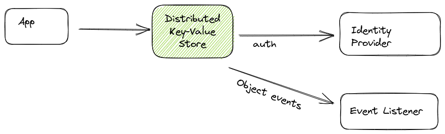
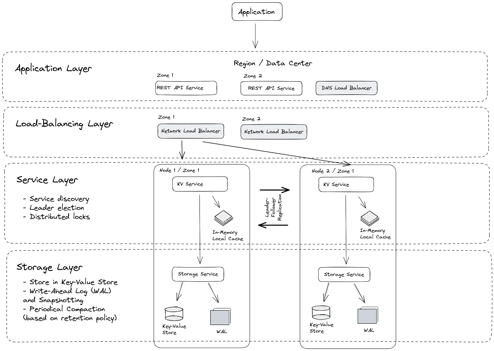
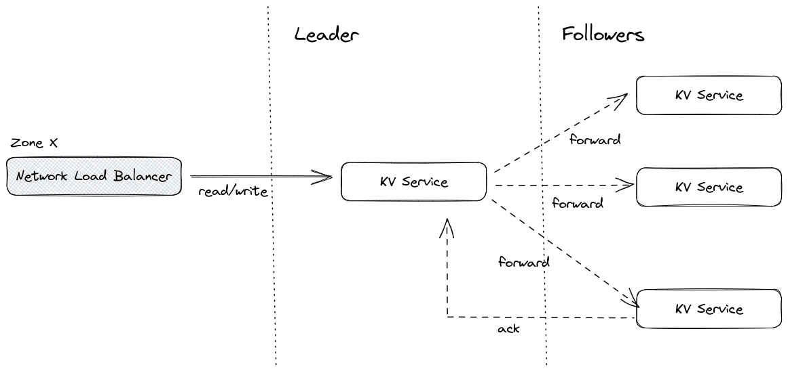
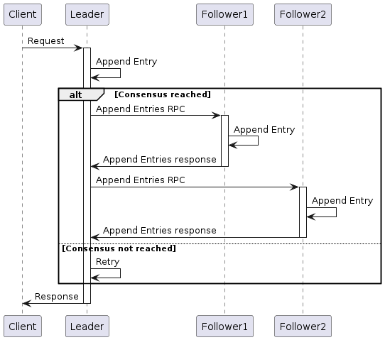
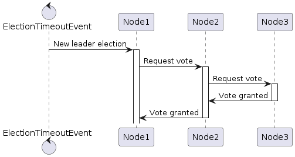

# Distributed Key-Value Store

## Main functions

1. Ensures consistency and availability of the data across the cluster
2. Highly available and fault-tolerant architecture
3. Simple and efficient API for storing and retrieving data

## Main features
- Fully replicated: Every node in the cluster has access the full data store.
- Highly available: with three or more odd number nodes and gracefully tolerate hardware failures and network partitions.
- Consistent: Every data ‘read’ returns the latest data ‘write’ across all clusters.
- Good write performance
- REST API: simple HTTP API

### Technical Requirements

- At least 10,000 writes per second.
- Distributed system that can run on multiple nodes
- No single point of failure

## System Context

## System Architecture Overview

## Stack Selection

- Network Load-Balancer: HAProxy
- Key-Value Store: BoltDB or LMDB (B+ tree / fast reads, MVCC)
- In-Memory Local Cache: LRU algorithm
- Replication algorithm: Raft

## Raft Consensus Algorithm

### Leader-Follower Replication

This sequence diagram shows a client sending a request to the leader node, which then tries to achieve consensus by appending the entry to its log and sending Append Entries RPCs to the follower nodes. If consensus is reached, the follower nodes acknowledge the entries by sending responses back to the leader. If consensus is not reached, the leader retries until it is successful. Finally, the leader sends a response back to the client with the result of the operation.

### New Leader Election

During normal operation, the leader sends periodic heartbeat messages to the other nodes in the cluster to let them know it is still alive and functioning properly. If a follower does not receive a heartbeat message within the election timeout period, it assumes that the leader has failed or is no longer able to communicate, and it starts a new leader election process.

When a follower starts a new leader election process, it becomes a candidate and sends RequestVote messages to the other nodes in the cluster to request their votes. The candidate that receives votes from a majority of the nodes becomes the new leader. This is known as the "majority rule".
