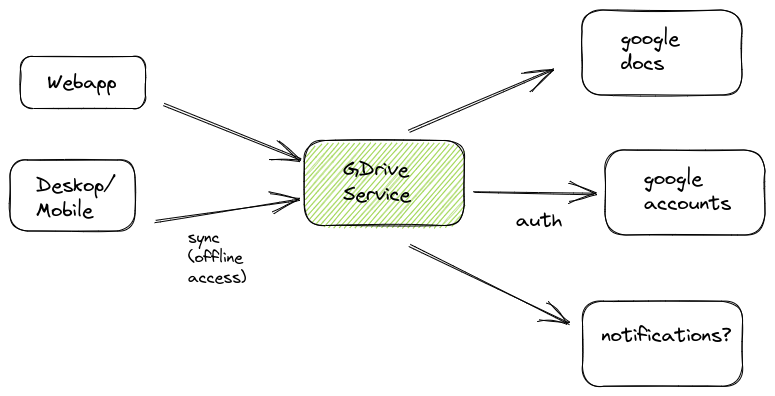
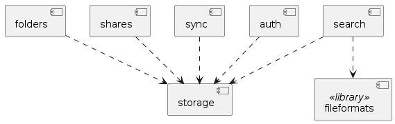
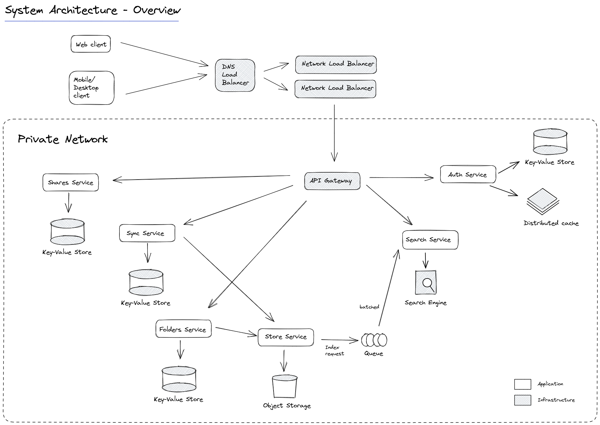
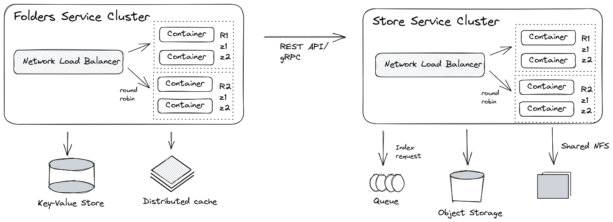
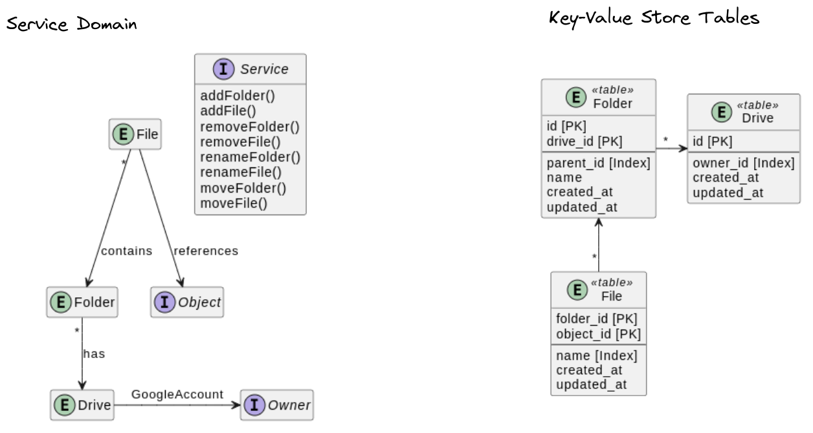

# Google Drive Service System Design

## Solution Requirements

### Main functions
- File Storage
- File Sharing
- Colloboration
- Backup and Sync
- Authentication - via Google Account (Auth)
- Integration with other Google Service (Docs, Sheets, Slides, Form...)

### Main features

- Large Storage Capacity
- File Formats
- File Management
- File Versions
- Search
- Offline access

### Technical Requirements

- 1 billion people
- 15 gb storage per user
- no data loss
- high availability

## System Context

A system context diagram, also known as a context diagram or a level 0 DFD (data flow diagram), is a high-level visual representation of a system and its environment. It shows the system as a single process or box surrounded by its external environment, which consists of entities or processes that interact with the system.

The purpose of a system context diagram is to provide a clear and concise overview of the system and its environment, showing the relationships and interactions between the system and its external entities. It is often used as a starting point for developing more detailed system models and requirements, and as a communication tool for stakeholders to understand the system and its boundaries.

## Service Components

- The "storage" component represents the storage service that is used to store the user's files and data. The "fileformats" component is a library that provides support for various file formats and is used by other components, such as "search".

- The "folders" component provides functionality for organizing and managing files in folders, and it interacts with the storage service to create, update, and delete folders and their contents.

- The "search" component provides a search interface that allows users to search for files based on keywords, file type, or other attributes. It relies on the storage service and the fileformats library to index and search through the user's files.

- The "shares" component provides functionality for sharing files with other users or groups. It interacts with the storage service to set file permissions and access rights for shared files.

- The "sync" component provides synchronization functionality to keep the user's files up-to-date across multiple devices. It interacts with the storage service to detect changes and updates made on other devices and ensures that the user's files are synced correctly.

- Finally, the "auth" component handles user authentication and authorization, ensuring that only authorized users can access the user's files and data stored in the storage service. It interacts with the storage service to verify user credentials and enforce access control policies.

### Infraestructure components

Building a scalable and reliable application requires a well-designed infrastructure that can handle the traffic and data demands. In order to achieve this, it is necessary to have a set of robust infrastructure components that work together seamlessly.

- API Gateway
- Object Storage System
- Database System
- Search Engine
- NFS (Network File System)
- DNS Load Balancer
- Service Clusters
- Message Queuing System
- Distributed Cache

## Overview System Architecture

## Service Details: Clusters

## Service Details: Folders

## Software Stack Selection

- Cloud Platform: AWS
- DNS Load Balancer: Router 53
- API Gateway: AWS API Gateway
- Key-Value Store: DynamoDB
- Object Storage: S3
- Distributed Cache: ElastiCache Redis
- Search Engine: Elasticsearch
- Queue system: SQS
