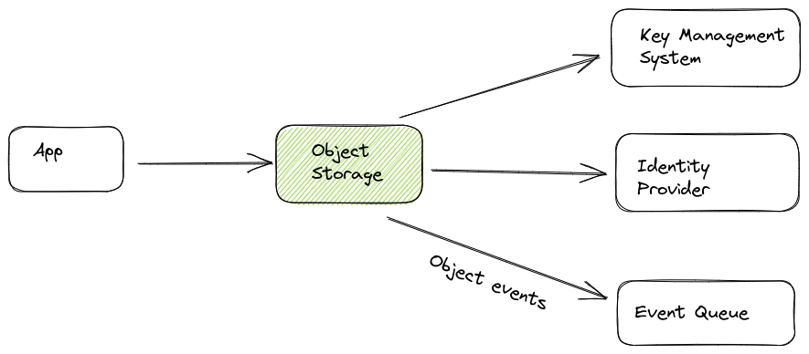
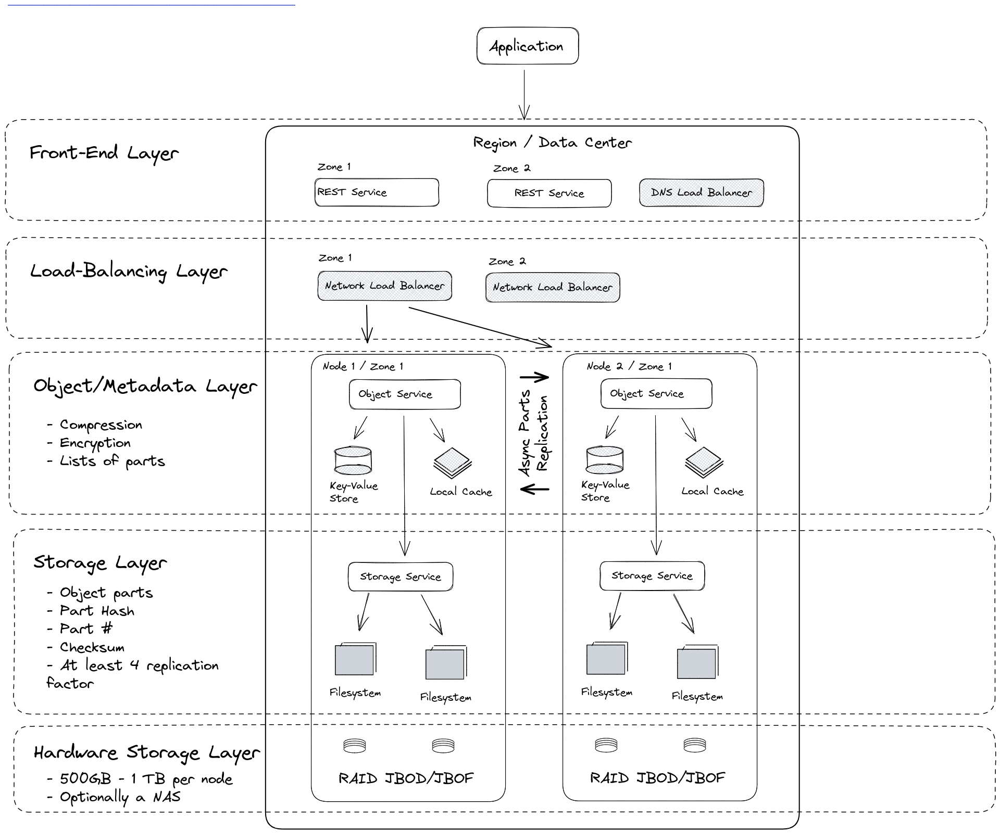
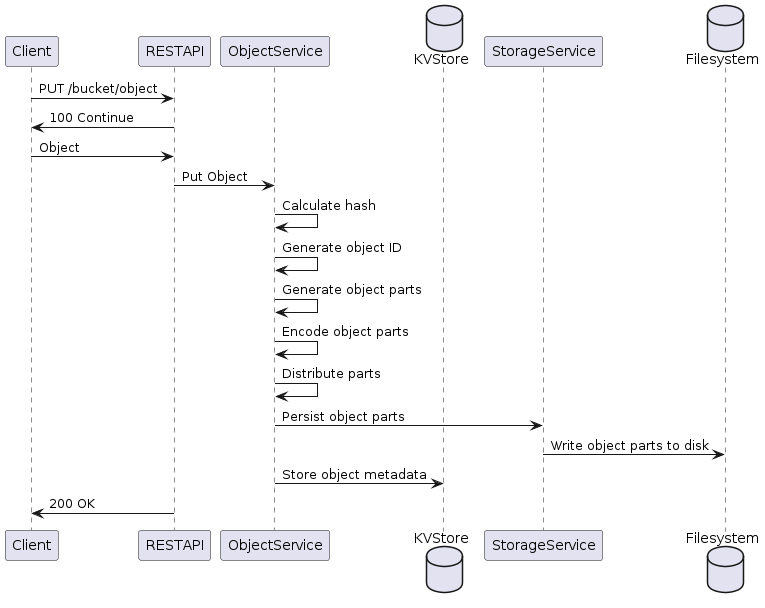
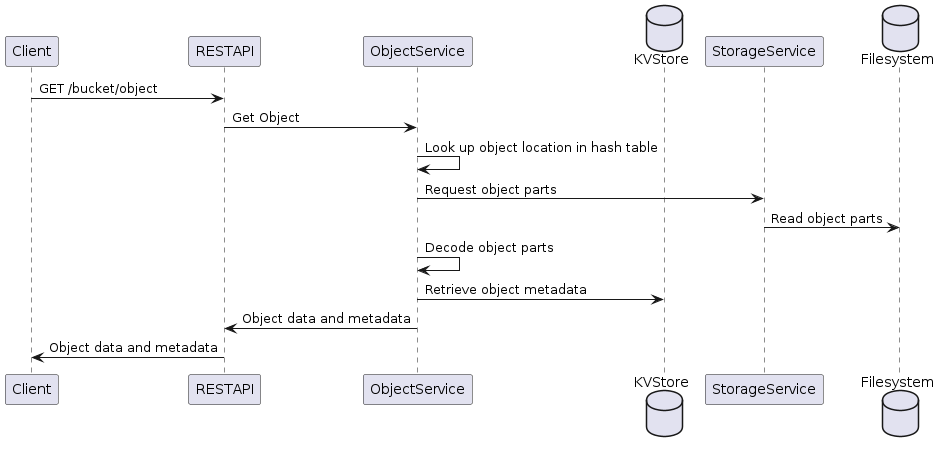

# Scalable Object Storage

## Solution Requirements

### Main functions

- Scalable and durable object storage
- High performance and low latency
- High availability

### Main features

- RESTful APIs
- Designed for high availability and durability with replication and eventual consistency
- Fault-tolerant and can be deployed on commodity hardware

### Technical Requirements

- Store petabytes
- Large file size (at least 5GB)
- Distributed system that can run on multiple nodes
- Support of large data sets

## System Context

## System Architecture Overview

## Operation: Put Object

## Operation: Get Object

## Software Stack Selection

- Services cluster: Kubernetes
- Key-Value Store: LMDB (B+ tree / fast reads)
- Filesystem: NFS / Ext3 (max. filesize 2TB, max. fs size 16TB)
- Local Cache: Disk-based LRU-Cache
- Sharding and Replication Implementation:
    - Erasure coding
    - Async replication (eventual consistency)
    - Checksum for object part integrity: MD5
    - Hash table for object part location: In-memory based on SHA256